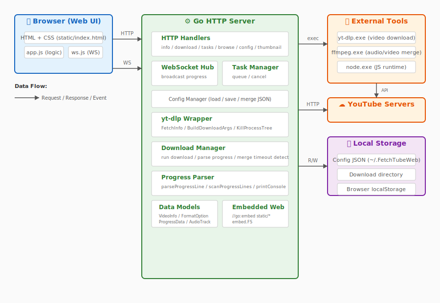
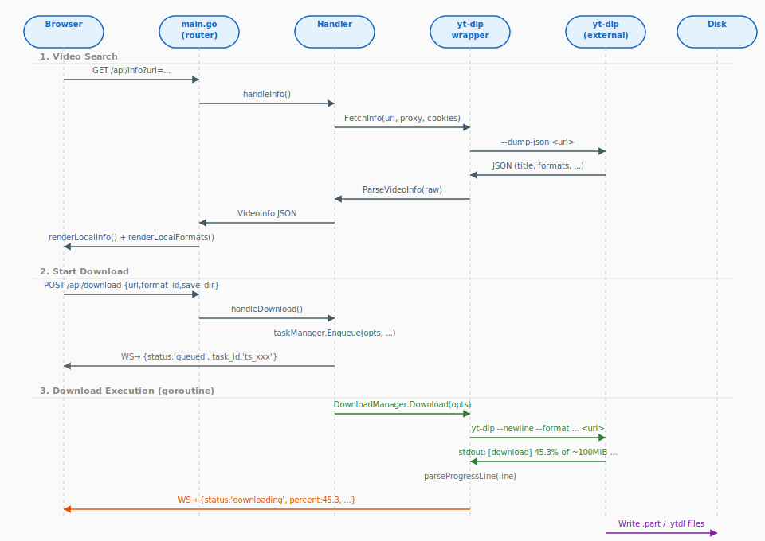
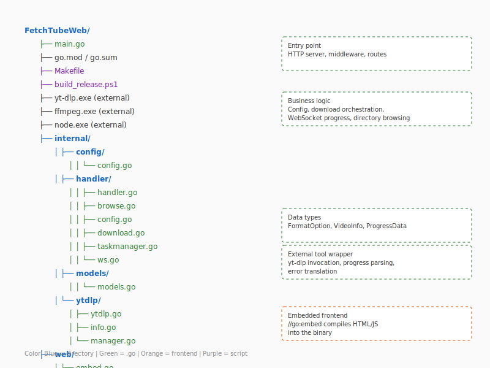
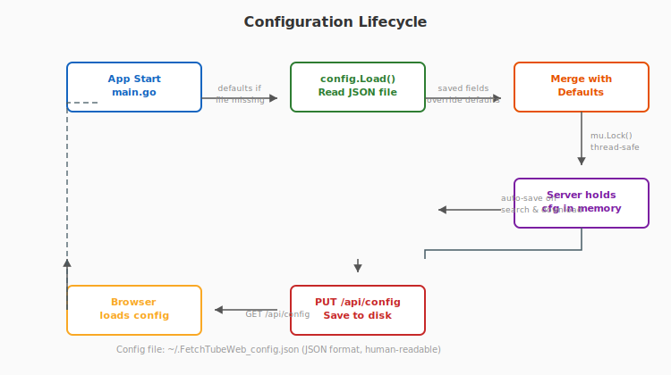
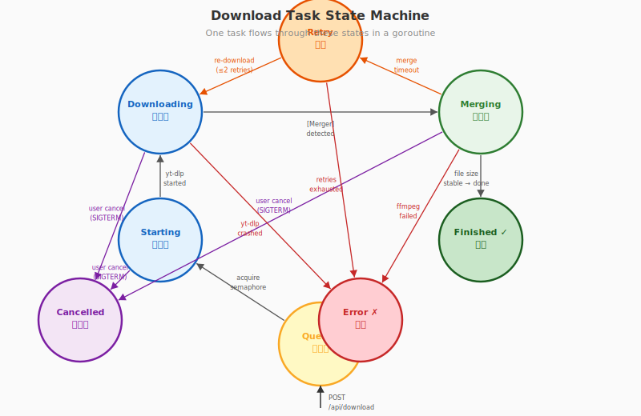
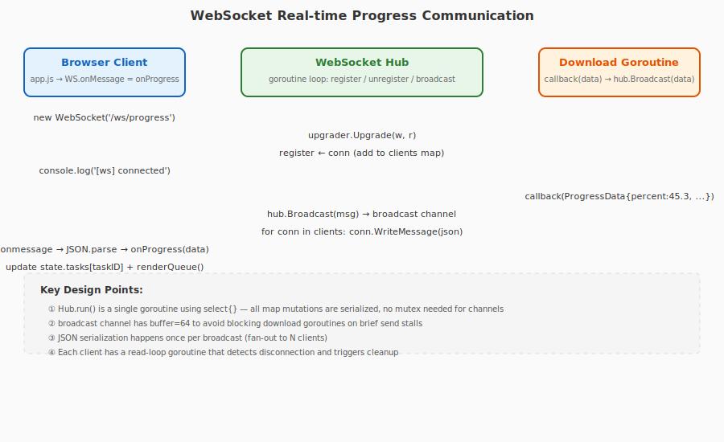

# FetchTubeWeb 工程代码深度讲解

> 面向 Go 语言和 Web 编程初学者的保姆级教程  
> 从零开始，逐函数、逐语法讲解整个项目的运行机制

---

## 目录

1. [项目概述](#1-项目概述)
2. [系统架构总览](#2-系统架构总览)
3. [Go 语言速成 —— 本项目用到的语法](#3-go-语言速成--本项目用到的语法)
4. [项目目录结构](#4-项目目录结构)
5. [main.go —— 程序入口](#5-maingo--程序入口)
6. [internal/config —— 配置管理](#6-internalconfig--配置管理)
7. [internal/models —— 数据模型](#7-internalmodels--数据模型)
8. [internal/ytdlp —— yt-dlp 调用封装](#8-internalytdlp--yt-dlp-调用封装)
9. [internal/handler —— HTTP 请求处理](#9-internalhandler--http-请求处理)
10. [web/ —— 前端静态资源](#10-web--前端静态资源)
11. [关键 Go 语法实战解析](#11-关键-go-语法实战解析)
12. [构建与发布](#12-构建与发布)

---

## 1. 项目概述

FetchTubeWeb 是一个 **YouTube 视频下载器**，由 Go 语言编写后端 + 原生 JavaScript 编写前端组成。

### 核心工作流程

```
用户输入 YouTube URL → 后端调用 yt-dlp 获取视频信息 → 前端展示可选格式
→ 用户选择分辨率和保存目录 → 后端调用 yt-dlp 下载 → 实时推送进度到前端
→ yt-dlp 下载完成后调用 ffmpeg 合并音视频 → 完成
```

### 技术栈

| 层级 | 技术 | 作用 |
|------|------|------|
| 后端 | Go 1.22+ | HTTP 服务器、任务调度、进程管理 |
| 前端 | 原生 HTML/CSS/JS | Web UI，无框架依赖 |
| 实时通信 | WebSocket | 下载进度实时推送到浏览器 |
| 视频下载 | yt-dlp (外部进程) | 实际执行 YouTube 视频下载 |
| 音视频合并 | ffmpeg (外部进程) | 将分离的音频流和视频流合并为 MKV/MP4 |
| JS 运行时 | Node.js (外部进程) | yt-dlp 需要它来执行 YouTube 的 JS challenge 验证 |

---

## 2. 系统架构总览



整个系统由 **浏览器前端**、**Go HTTP 服务器**、**三个外部工具**（yt-dlp、ffmpeg、node）、**本地存储** 五个部分组成。

### 通信流程



上图展示了一次完整的 "搜索视频 → 下载 → 合并 → 完成" 过程中的所有通信步骤。

---

## 3. Go 语言速成 —— 本项目用到的语法

如果你是 Go 语言新手，先花 5 分钟了解这些基本语法，后面看代码会轻松很多。

### 3.1 包 (package)

Go 以包（package）组织代码。每个 `.go` 文件的第一行声明它属于哪个包：

```go
package main       // main 包 → 可执行程序入口
package handler    // handler 包 → 库代码
```

- `package main` 必须有 `func main()` 作为程序起点
- 其他包名通常与目录名相同

### 3.2 导入 (import)

```go
import (
    "fmt"              // 标准库：格式化输出
    "net/http"         // 标准库：HTTP 服务器
    "FetchTubeWeb/internal/handler"  // 本项目内部包
)
```

### 3.3 变量声明

```go
// 短声明（最常用，类型自动推导）
port := 8899
name := "hello"

// 带类型的声明
var version string = "dev"
var count int

// 结构体字面量
srv := &Server{
    cfg:   config.Load(),
    tasks: NewTaskManager(),
}
```

### 3.4 函数

```go
// 基本函数
func add(a int, b int) int {
    return a + b
}

// 方法（给类型绑定函数）
func (s *Server) handleInfo(w http.ResponseWriter, r *http.Request) {
    // s 是接收者（receiver），相当于其他语言的 this
}

// 多返回值（Go 特色）
func Load() (AppConfig, error) {
    // ...
    return cfg, nil
}
```

### 3.5 指针

```go
x := 42
p := &x       // p 是指向 x 的指针
*p = 100      // 通过指针修改 x

// & 取地址，* 解引用
// Go 没有指针运算，比 C 安全很多
```

### 3.6 结构体与 JSON

```go
type VideoInfo struct {
    Title    string `json:"title"`     // 结构体标签：JSON 序列化时字段名
    Duration int    `json:"duration"`
}

// 序列化
data, _ := json.Marshal(info)         // Go 对象 → JSON 字节
json.NewEncoder(w).Encode(info)       // Go 对象 → JSON 并写入 http.ResponseWriter

// 反序列化
json.Unmarshal(data, &info)           // JSON 字节 → Go 对象
json.NewDecoder(r.Body).Decode(&cfg)  // 从 HTTP Body 读取 JSON → Go 对象
```

### 3.7 错误处理

Go 没有 try-catch，通过返回值处理错误：

```go
data, err := os.ReadFile(path)
if err != nil {
    log.Printf("read failed: %v", err)  // %v 打印任意值
    return defaultValue
}
// 使用 data...
```

### 3.8 Goroutine —— Go 的并发

```go
// go 关键字启动一个新的并发任务
go func() {
    // 这里的代码异步运行
    download()
}()

// channel：goroutine 之间通信的管道
ch := make(chan string, 10)  // 缓冲区大小为 10 的字符串管道
ch <- "hello"                 // 发送
msg := <-ch                   // 接收
```

### 3.9 defer —— 延迟执行

```go
func example() {
    f, _ := os.Open("file.txt")
    defer f.Close()  // 函数返回前一定执行，类似 Java 的 finally
    // 处理文件...
}
```

### 3.10 interface{} —— 任意类型

```go
// interface{} 可以存储任何类型的值（类似 Java 的 Object）
var x interface{} = "hello"
x = 42    // 也可以是 int

// 类型断言
if str, ok := x.(string); ok {
    fmt.Println(str)
}
```

---

## 4. 项目目录结构



| 路径 | 作用 |
|------|------|
| `main.go` | 程序入口，启动 HTTP 服务器 |
| `internal/config/` | 配置文件的加载、保存、合并 |
| `internal/models/` | 数据结构定义（DTO） |
| `internal/ytdlp/` | yt-dlp 进程调用、进度解析 |
| `internal/handler/` | HTTP 请求处理器（Controller 层） |
| `web/` | 前端静态资源（内嵌到二进制中） |
| `build_release.ps1` | Windows 发布构建脚本 |
| `.github/workflows/` | CI/CD 自动构建 |

`internal/` 是 Go 的约定：放在 internal 下的包，其他项目无法导入，仅本项目内部使用。

---

## 5. main.go —— 程序入口

> 📍 文件：[main.go](../main.go)

这是整个程序的起点。让我们逐段分析：

### 5.1 包声明 & 导入

```go
package main

import (
    "flag"
    "fmt"
    "log"
    "net/http"
    "os/exec"
    "runtime"
    "strings"
    "time"

    "FetchTubeWeb/internal/handler"
    "FetchTubeWeb/web"
)

var version = "dev" // 编译时通过 -ldflags 注入真实版本号
```

**新手要点：**
- `package main` + `func main()` = 可执行程序
- `version` 是包级变量，在 `main` 函数外声明，整个包都能访问
- `"FetchTubeWeb/..."` 是**模块内导入**，路径由 `go.mod` 中的 `module FetchTubeWeb` 决定

### 5.2 main() 函数

```go
func main() {
    // ① 解析命令行参数
    port := flag.Int("port", 8899, "HTTP listen port")
    flag.Parse()
```

**Go 语法点：**
- `flag.Int("port", 8899, "HTTP listen port")` ：定义一个整数类型的命令行标志
  - `"port"` — 参数名，命令行用 `--port`
  - `8899` — 默认值
  - 第三个参数 — 帮助说明
- `flag.Parse()` — 解析命令行，必须在访问参数值之前调用
- `*port` — 解引用指针获取实际值

```go
    // ② 参数校验
    if *port < 1 || *port > 65535 {
        log.Fatalf("Invalid port: %d (range: 1-65535)", *port)
    }
```

`log.Fatalf` 打印错误并调用 `os.Exit(1)` 终止程序。TCP 端口范围是 1-65535。

```go
    // ③ 创建服务器实例
    srv := handler.NewServer()
```

这里初始化了三个核心组件：配置、任务管理器、WebSocket Hub（详见第 9 章）。

```go
    // ④ 注册路由
    mux := http.NewServeMux()

    mux.Handle("GET /static/", http.FileServer(http.FS(web.Assets)))
    mux.HandleFunc("GET /", func(w http.ResponseWriter, r *http.Request) {
        if r.URL.Path == "/" || r.URL.Path == "/index.html" {
            w.Header().Set("Content-Type", "text/html; charset=utf-8")
            data, _ := web.Assets.ReadFile("static/index.html")
            w.Write(data)
            return
        }
        http.NotFound(w, r)
    })

    srv.SetupRoutes(mux)
```

**Go 1.22 新特性：方法路由**
```go
mux.Handle("GET /static/", handler)  // 同时匹配 HTTP 方法和路径
mux.Handle("POST /api/download", handler)  // 只匹配 POST
```
在 Go 1.22 之前需要用第三方路由库，现在标准库原生支持。

**匿名函数作为 Handler：**
```go
mux.HandleFunc("GET /", func(w http.ResponseWriter, r *http.Request) {
    // 这是一个匿名函数（闭包），直接内联处理逻辑
})
```

```go
    // ⑤ 中间件包装
    wrapped := withMiddleware(mux)

    // ⑥ 配置 HTTP 服务器
    addr := fmt.Sprintf("127.0.0.1:%d", *port)
    server := &http.Server{
        Addr:         addr,
        Handler:      wrapped,
        ReadTimeout:  30 * time.Second,
        WriteTimeout: 0,  // WebSocket 连接需要无限写超时
        IdleTimeout:  120 * time.Second,
    }
```

**`fmt.Sprintf`** 是格式化字符串函数，类似 C 的 `printf`，但返回字符串而不是打印。
- `%d` — 格式化为整数

**`&http.Server{...}`**：`&` 表示取结构体字面量的地址。Go 中通常传递结构体指针以避免拷贝。

```go
    // ⑦ 启动
    printBanner(*port)
    go openBrowser(fmt.Sprintf("http://localhost:%d", *port))

    if err := server.ListenAndServe(); err != nil {
        log.Fatalf("Server failed to start: %v", err)
    }
}
```

**`go openBrowser(...)`** —— `go` 关键字启动一个新的 goroutine，浏览器打开与服务器启动**并行执行**，互不阻塞。

### 5.3 printBanner() —— 打印启动横幅

```go
func printBanner(port int) {
    fmt.Println(strings.Repeat("=", 56))
    fmt.Printf("  🎬 YouTube Video Downloader (Go WebUI)  v%s\n", version)
    fmt.Println(strings.Repeat("=", 56))
    fmt.Printf("  WebUI URL:  http://localhost:%d\n", port)
    fmt.Printf("  Press Ctrl+C to stop\n")
    fmt.Println(strings.Repeat("=", 56))
}
```

**Go 语法点：**
- `strings.Repeat` 重复字符串 N 次 —— 生成分隔线
- `fmt.Printf` 格式化打印，`%s` 字符串、`%d` 整数、`\n` 换行

### 5.4 withMiddleware() —— 中间件

```go
func withMiddleware(next http.Handler) http.Handler {
    return http.HandlerFunc(func(w http.ResponseWriter, r *http.Request) {
        // CORS 头（允许浏览器跨域请求）
        w.Header().Set("Access-Control-Allow-Origin", "*")
        w.Header().Set("Access-Control-Allow-Methods", "GET, POST, PUT, DELETE, OPTIONS")
        w.Header().Set("Access-Control-Allow-Headers", "Content-Type")

        if r.Method == "OPTIONS" {
            w.WriteHeader(200)
            return
        }

        // 请求日志
        start := time.Now()
        next.ServeHTTP(w, r)
        log.Printf("[http] %s %s %v", r.Method, r.URL.Path, time.Since(start))
    })
}
```

**设计模式：装饰器模式**

```
请求 → CORS 处理 → 下一个 Handler → 日志记录 → 响应
```

**Go 语法点：**
- `http.Handler` 是一个接口（interface），只有一个方法 `ServeHTTP(w, r)`
- `http.HandlerFunc(f)` 将普通函数 `f` 转换为 Handler 接口类型
- `next.ServeHTTP(w, r)` 调用链中的下一个处理器
- `time.Since(start)` 返回从 start 到现在的耗时

### 5.5 openBrowser() —— 跨平台打开浏览器

```go
func openBrowser(url string) {
    var cmd string
    var args []string

    switch runtime.GOOS {
    case "windows":
        cmd = "cmd"
        args = []string{"/c", "start", url}
    case "darwin":
        cmd = "open"
        args = []string{url}
    default:  // Linux 等
        cmd = "xdg-open"
        args = []string{url}
    }

    _ = exec.Command(cmd, args...).Start()
}
```

**Go 语法点：**
- `runtime.GOOS` — 运行时检测操作系统，值为 `"windows"` / `"darwin"` / `"linux"`
- `switch` 语句不需要 `break`，Go 默认只执行匹配的 case
- `args...` — 展开切片（spread operator）
- `_ =` — 空白标识符，丢弃不需要的返回值（这里丢弃 error）
- `exec.Command` 创建外部命令，`Start()` 非阻塞启动

---

## 6. internal/config —— 配置管理

> 📍 文件：[internal/config/config.go](../internal/config/config.go)

### 6.1 配置结构体

```go
type AppConfig struct {
    Local LocalConfig `json:"local"`
}

type LocalConfig struct {
    LastURL             string `json:"last_url"`              
    ProxyMode           string `json:"proxy_mode"`            // "None" | "HTTP" | "SOCKS5"
    ProxyHost           string `json:"proxy_host"`
    ProxyPort           string `json:"proxy_port"`
    OutputFormat        string `json:"output_format"`         // "mp4" | "webm" | "mkv"
    ConcurrentFragments int    `json:"concurrent_fragments"`  // 1-32
    Cookies             string `json:"cookies"`               // "None" | "Chrome" | "Firefox" | ...
    CookiesPath         string `json:"cookies_path"`
    SaveDir             string `json:"save_dir"`
    KeepTempFiles       bool   `json:"keep_temp_files"`
}
```

**Go 语法精讲：结构体标签 (struct tags)**

```go
LastURL string `json:"last_url"`
```

反引号 `` ` `` 内的内容叫**结构体标签**。这里 `json:"last_url"` 告诉 `encoding/json` 包：
- 序列化（Go → JSON）时用 `last_url` 作为 JSON 键名
- 反序列化（JSON → Go）时从 `last_url` 字段取值

**为什么这样设计？** Go 的命名惯例是驼峰式（`LastURL`），但 JSON 惯例是蛇形（`last_url`）。结构体标签桥接了这两种风格。

### 6.2 配置加载流程



```go
func Load() AppConfig {
    cfg := DefaultConfig()       // ① 从硬编码的默认值开始
    path := configPath()         // ② 确定配置文件路径 ~/.FetchTubeWeb_config.json

    data, err := os.ReadFile(path)
    if err != nil {
        log.Printf("[config] config not found, using defaults (%s)", path)
        return cfg               // ③ 文件不存在 → 返回默认值
    }

    var saved AppConfig
    if err := json.Unmarshal(data, &saved); err != nil {
        return cfg               // ④ JSON 损坏 → 返回默认值（容错设计）
    }

    merge(&cfg, &saved)          // ⑤ 将保存的值覆盖默认值
    return cfg
}
```

**设计亮点：优雅降级。** 即使配置文件损坏或不存在，程序也能用默认值正常运行。

### 6.3 merge() —— 字段级合并

```go
func merge(dst *AppConfig, saved *AppConfig) {
    if saved.Local.LastURL != "" {
        dst.Local.LastURL = saved.Local.LastURL
    }
    if saved.Local.ProxyMode != "" {
        dst.Local.ProxyMode = saved.Local.ProxyMode
    }
    // ... 每个字段都要写一遍
}
```

**实现原理：** 只覆盖**非零值**字段。对于：
- `string` — 零值是 `""`
- `int` — 零值是 `0`
- `bool` — 零值是 `false`

这样用户只保存了他修改过的字段，未修改的保留默认值。

> ⚠️ 这种手工 merge 方式扩展性不好，但对于小型配置已经足够。

### 6.4 Save() —— 持久化到磁盘

```go
func Save(cfg AppConfig) error {
    data, err := json.MarshalIndent(cfg, "", "  ")
    if err != nil {
        return err
    }
    path := configPath()
    log.Printf("[config] saved: %s", path)
    return os.WriteFile(path, data, 0644)
}
```

**`json.MarshalIndent(cfg, "", "  ")`** 三个参数：
1. 要序列化的对象
2. 每行的前缀（空）
3. 缩进字符串（两个空格）

输出示例：
```json
{
  "local": {
    "last_url": "https://youtube.com/watch?v=xxx",
    "proxy_mode": "None",
    "output_format": "mkv"
  }
}
```

`0644` 是 Unix 文件权限（八进制）：所有者可读写，组/其他人只读。

---

## 7. internal/models —— 数据模型

> 📍 文件：[internal/models/models.go](../internal/models/models.go)

这个文件定义了项目中用到的所有数据结构。

### 7.1 FormatOption —— 视频格式

```go
type FormatOption struct {
    FormatID    string  `json:"format_id"`
    VideoID     string  `json:"video_id"`
    Resolution  string  `json:"resolution"`    // "1920x1080"
    FPS         int     `json:"fps"`
    Codec       string  `json:"codec"`
    AudioCodec  string  `json:"audio_codec"`
    FileSizeMB  float64 `json:"file_size_mb"`
    Ext         string  `json:"ext"`
    Note        string  `json:"note"`           // "1080p60"
}
```

一个 YouTube 视频通常有多个可用格式，比如：
| Format ID | Resolution | Codec | Size |
|-----------|-----------|-------|------|
| 299+140 | 1920x1080 | avc1 | 150MB |
| 298+140 | 1280x720 | avc1 | 80MB |
| 247+140 | 854x480 | vp9 | 40MB |

### 7.2 AudioTrack —— 音频轨道

```go
type AudioTrack struct {
    FormatID string `json:"format_id"`
    Language string `json:"language"`   // "English", "Japanese" ...
    Bitrate  int    `json:"abr"`        // 码率 kbps
    Codec    string `json:"codec"`
    Note     string `json:"note"`
}
```

YouTube 的多语言视频会提供多条音频轨道。用户可以选择保留哪些语言。

### 7.3 VideoInfo —— 完整的视频元信息

```go
type VideoInfo struct {
    Title           string         `json:"title"`
    URL             string         `json:"url"`
    ThumbnailURL    string         `json:"thumbnail_url"`
    DurationSeconds int            `json:"duration_seconds"`
    DurationStr     string         `json:"duration_str"`
    Uploader        string         `json:"uploader"`
    ViewCount       int            `json:"view_count"`
    LikeCount       int            `json:"like_count"`
    Description     string         `json:"description"`
    Formats         []FormatOption  `json:"formats"`       // 可选格式列表
    AudioTracks     []AudioTrack   `json:"audio_tracks"`   // 可选音轨列表
}
```

**Go 语法点：切片 (slice)**

```go
Formats []FormatOption   // 方括号前没有数字 = 切片，动态数组
```

Go 有数组和切片两种类型：
- `[5]int` — 固定长度数组，长度是类型的一部分
- `[]int` — 切片，可变长度，底层是动态数组

### 7.4 ProgressData —— 下载进度

这是在 [manager.go](../internal/ytdlp/manager.go) 中定义的而非 models 中，因为它是 yt-dlp 调用层的概念：

```go
type ProgressData struct {
    Status         string  `json:"status"`          // "downloading" | "merging" | "finished" | "error"
    Percent        float64 `json:"percent"`
    SpeedMBps      float64 `json:"speed_mbps"`
    TotalMB        float64 `json:"total_mb"`
    ETASeconds     int     `json:"eta_seconds"`
    FragmentIndex  int     `json:"fragment_index"`   // 分片下载：当前第几个
    FragmentCount  int     `json:"fragment_count"`   // 分片下载：总共几个
    ErrorMessage   string  `json:"error_message,omitempty"`
}
```

**`omitempty` 标签：** 当字段为空（零值）时，JSON 输出中省略该字段。这样前端收到的 JSON 更简洁。

---

## 8. internal/ytdlp —— yt-dlp 调用封装

这是项目的**核心模块**，负责与 yt-dlp 外部进程通信。

> 📍 三个文件：
> - [ytdlp.go](../internal/ytdlp/ytdlp.go) — 工具查找、命令构建、错误翻译
> - [info.go](../internal/ytdlp/info.go) — 视频信息解析
> - [manager.go](../internal/ytdlp/manager.go) — 下载执行、进度解析

### 8.1 工具查找 —— FindYtDlp / FindFFmpeg / FindNode

```go
func FindYtDlp() string {
    exeDir := exeDirectory()             // ① 获取程序所在目录
    if exeDir != "" {
        candidate := filepath.Join(exeDir, "yt-dlp.exe")
        if fileExists(candidate) {
            return candidate             // ② 同目录找到了 → 返回
        }
    }
    p, _ := exec.LookPath("yt-dlp.exe")  // ③ 从系统 PATH 中找
    if p != "" {
        return p
    }
    p, _ = exec.LookPath("yt-dlp")       // ④ Unix 下尝试不带 .exe
    return p
}
```

**Go 语法点：`exec.LookPath`** 在系统的 PATH 环境变量中搜索可执行文件，类似 Linux 的 `which` 命令。

**`_, _ =`** 模式：用空白标识符忽略不关心的返回值（这里是 error）。

### 8.2 FetchInfo —— 获取视频信息

```go
func FetchInfo(url, proxy, cookies string) (*RawInfo, error) {
    ytdlp := FindYtDlp()
    if ytdlp == "" {
        return nil, fmt.Errorf("yt-dlp.exe not found")
    }
    return fetchInfoOnce(ytdlp, url, proxy, cookies)
}
```

**Go 惯例：** 公有函数返回 `(result, error)`，调用者必须检查 error。

```go
func fetchInfoOnce(ytdlp, url, proxy, cookies string) (*RawInfo, error) {
    args := []string{"--dump-json", "--no-warnings", "--no-playlist"}

    if proxy != "" {
        args = append(args, "--proxy", proxy)
    }
    if node := FindNode(); node != "" {
        args = append(args, "--js-runtimes", "node:"+node)
    }
    // ...构建更多参数...

    cmd := exec.Command(ytdlp, args...)
    cmd.Stderr = &stderr
    output, err := cmd.Output()   // 执行并捕获 stdout
    // ...
    json.Unmarshal(output, &info) // 解析 JSON 输出
    return &info, nil
}
```

**Go 语法精讲：exec.Command**

```go
cmd := exec.Command(ytdlp, args...)
```

这行代码创建了一个**待执行的命令**（但还没执行）。等价于在终端输入：
```bash
yt-dlp --dump-json --no-warnings https://youtube.com/watch?v=xxx
```

`cmd.Output()` 执行命令并返回 stdout。`cmd.Stderr = &stderr` 重定向 stderr 到内存 buffer。

### 8.3 ParseVideoInfo —— 解析视频信息

> 📍 [info.go](../internal/ytdlp/info.go)

这是项目中**最复杂的解析函数**。yt-dlp 返回的 JSON 包含几十个格式，需要筛选、排序、组合。

**核心逻辑：**

```
所有格式 → ①找最佳音频流（跳过 DRC 变体）
        → ②按高度分组，每组选最佳视频流
        → ③组合"视频流ID+音频流ID"
        → ④计算文件大小（有文件大小数据优先）
        → ⑤提取音频轨道列表
        → ⑥按分辨率和大小排序输出
```

**Go 语法精讲：map**

```go
dashVideo := make(map[int]*RawFormat)    // key: 高度, value: 该高度的最佳视频流
videoByHeight := make(map[int]*RawFormat) // 同上但包含更多格式
```

`map[int]*RawFormat` 读作 "从 int 到 RawFormat 指针的映射"，类似其他语言的 HashMap / Dictionary。

**Go 语法精讲：切片排序**

```go
sort.Slice(formats, func(i, j int) bool {
    a := formats[i]
    b := formats[j]
    aH := parseHeight(a.Resolution)
    bH := parseHeight(b.Resolution)
    if aH != bH {
        return aH > bH    // 分辨率高的排前面
    }
    return a.FileSizeMB > b.FileSizeMB  // 同分辨率下文件大的排前面
})
```

`sort.Slice` 接受一个**比较函数**。返回 `true` 时 `i` 排在 `j` 前面。这比 Java 的 Comparator 更简洁。

**编码器优先级：**

```go
var codecRank = map[string]int{
    "avc1": 2000,   // H.264 兼容性最好，权重最高
    "vp9":  1000,   // VP9 次之
    "av01": 0,      // AV1 最不兼容
}
```

在同等分辨率下，优先选择 H.264 (avc1) 编码的流，因为兼容性最好。

### 8.4 Download —— 执行下载

> 📍 [manager.go](../internal/ytdlp/manager.go)

这是**项目的核心引擎**。下载过程用一个 goroutine 异步执行，通过 WebSocket 实时推送进度。

#### 8.4.1 下载状态机



每个下载任务经历 7 个状态：

| 状态 | 含义 | 触发条件 |
|------|------|----------|
| `queued` | 已在队列，等待并发槽位 | 用户点击下载 |
| `starting` | 获取了并发槽位，正在启动 yt-dlp | semaphore 可用 |
| `downloading` | yt-dlp 正在下载 | yt-dlp stdout 有进度输出 |
| `merging` | ffmpeg 正在合并音视频 | 检测到 `[Merger]` 输出 |
| `finished` | 下载完成 | 文件大小不再增长 |
| `error` | 下载失败 | yt-dlp 异常退出 |
| `cancelled` | 用户取消 | 点击取消按钮 |

#### 8.4.2 并发控制

```go
const maxConcurrent = 3  // 最多同时下载 3 个视频

type TaskManager struct {
    semaphore chan struct{}  // Go 的经典模式：用 channel 做信号量
}
```

**Go 语法精讲：channel 作为信号量**

```go
// 初始化
semaphore: make(chan struct{}, maxConcurrent)

// 获取槽位（如果 channel 满了会阻塞）
tm.semaphore <- struct{}{}

// 释放槽位
<-tm.semaphore
```

这是 Go 中非常常见的模式。`struct{}` 是零内存占用类型，只用于信号传递。

#### 8.4.3 进度解析

yt-dlp 输出格式示例：
```
[download]  45.3% of ~100.00MiB at  2.50MiB/s ETA 00:38 (frag 5/8)
```

Go 使用**正则表达式**解析这行文本：

```go
func parseProgressLine(line string) *ProgressData {
    if strings.Contains(line, "[download]") && strings.Contains(line, "%") {
        data := &ProgressData{Status: "downloading"}

        // 正则：匹配百分比
        if re := regexp.MustCompile(`(\d+\.?\d*)%`); re != nil {
            if m := re.FindStringSubmatch(line); len(m) >= 2 {
                fmt.Sscanf(m[1], "%f", &data.Percent)
            }
        }
        // ... 类似的匹配速度、大小、ETA、分片信息
    }
}
```

**Go 语法精讲：正则表达式**

```go
re := regexp.MustCompile(`(\d+\.?\d*)%`)
```

- `\d+` — 一个或多个数字
- `\.?` — 可选的小数点
- `\d*` — 零个或多个数字
- `(...)` — 捕获组，匹配的内容可以通过 `FindStringSubmatch` 提取
- `%` — 字面的百分号

#### 8.4.4 合并阶段超时检测

下载完成后 yt-dlp 启动 ffmpeg 合并，但 ffmpeg **不输出进度**。我们需要检测合并何时完成：

```go
// 僵死检测（stall detection）
if now.Sub(lastMsgTime) > MergeStallSecs {  // 超过 30 秒无新输出
    outputFiles := findOutputFiles(opts.SaveDir)
    if len(outputFiles) > 0 {
        stat, _ := os.Stat(outputFiles[0])
        currentSize := stat.Size()
        if currentSize == lastFileSize && currentSize > 0 {
            // 文件大小稳定 → 合并完成！
            KillProcessTree(cmd)
            // ... 发送 finished 回调
            return "done"
        }
        lastFileSize = currentSize
    }
}
```

**巧妙的设计：** 由于 ffmpeg 合并时不输出进度，我们通过**轮询输出文件的大小**来判断合并是否完成。当文件大小连续 30 秒不变化时，认为合并结束。

#### 8.4.5 进度扫描器

```go
func scanProgressLines(data []byte, atEOF bool) (advance int, token []byte, err error) {
    for i, b := range data {
        if b == '\n' || b == '\r' {
            return i + 1, data[:i], nil   // 遇到 \n 或 \r 就切分一行
        }
    }
    if atEOF {
        return len(data), data, nil        // 到文件尾返回剩余数据
    }
    return 0, nil, nil                     // 需要更多数据
}
```

这是 `bufio.Scanner` 的**自定义 SplitFunc**。默认的 `ScanLines` 只按 `\n` 分割，但这个函数同时支持 `\r`（回车符）和 `\n`（换行符）。因为 yt-dlp 默认用 `\r` 做进度原地刷新。

---

## 9. internal/handler —— HTTP 请求处理

> 📍 文件：
> - [handler.go](../internal/handler/handler.go) — 路由注册、公共工具函数
> - [download.go](../internal/handler/download.go) — 核心业务 API
> - [taskmanager.go](../internal/handler/taskmanager.go) — 异步任务管理
> - [ws.go](../internal/handler/ws.go) — WebSocket 实时通信
> - [browse.go](../internal/handler/browse.go) — 目录浏览
> - [config.go](../internal/handler/config.go) — 配置读写 API

### 9.1 路由注册

```go
func (s *Server) SetupRoutes(mux *http.ServeMux) {
    mux.HandleFunc("GET /api/info", s.handleInfo)
    mux.HandleFunc("POST /api/download", s.handleDownload)
    mux.HandleFunc("GET /api/tasks", s.handleListTasks)
    mux.HandleFunc("POST /api/tasks/{taskID}/cancel", s.handleCancelTask)
    mux.HandleFunc("DELETE /api/tasks/{taskID}", s.handleDeleteTask)
    mux.HandleFunc("POST /api/tasks/batch-delete", s.handleBatchDeleteTasks)
    mux.HandleFunc("POST /api/open-dir", s.handleOpenDir)
    mux.HandleFunc("POST /api/pick-folder", s.handlePickFolder)
    mux.HandleFunc("GET /api/config", s.handleGetConfig)
    mux.HandleFunc("PUT /api/config", s.handlePutConfig)
    mux.HandleFunc("GET /api/health", s.handleHealth)
    mux.HandleFunc("GET /api/browse", s.handleBrowse)
    mux.HandleFunc("GET /api/drives", s.handleDrives)
    mux.HandleFunc("GET /api/thumbnail", s.handleThumbnail)
    mux.HandleFunc("GET /ws/progress", s.handleWebSocket)
}
```

**Go 1.22 路径参数：**

```go
mux.HandleFunc("POST /api/tasks/{taskID}/cancel", s.handleCancelTask)
```

`{taskID}` 是路径参数，在 handler 中通过 `r.PathValue("taskID")` 获取：

```go
func (s *Server) handleCancelTask(w http.ResponseWriter, r *http.Request) {
    taskID := r.PathValue("taskID")  // 从 URL 中提取 taskID
    // POST /api/tasks/ts_ABCD1234/cancel → taskID = "ts_ABCD1234"
}
```

### 9.2 API 路由一览

| 方法 | 路径 | 作用 |
|------|------|------|
| `GET` | `/api/info?url=...` | 获取视频信息 |
| `POST` | `/api/download` | 开始下载 |
| `GET` | `/api/tasks` | 列出所有任务 |
| `POST` | `/api/tasks/{id}/cancel` | 取消任务 |
| `DELETE` | `/api/tasks/{id}` | 删除任务记录 |
| `POST` | `/api/tasks/batch-delete` | 批量删除 |
| `POST` | `/api/open-dir` | 打开资源管理器 |
| `POST` | `/api/pick-folder` | 原生文件夹选择 |
| `GET` | `/api/config` | 读取配置 |
| `PUT` | `/api/config` | 保存配置 |
| `GET` | `/api/health` | 健康检查 |
| `GET` | `/api/browse?path=...` | 浏览目录 |
| `GET` | `/api/drives` | 列出驱动器 |
| `GET` | `/api/thumbnail?url=...` | 代理获取缩略图 |
| `GET` | `/ws/progress` | WebSocket 连接 |

### 9.3 handleDownload —— 核心下载 API

```go
func (s *Server) handleDownload(w http.ResponseWriter, r *http.Request) {
    // ① 解析请求体
    var req struct {
        URL                string `json:"url"`
        FormatID           string `json:"format_id"`
        OutputExt          string `json:"output_ext"`
        SaveDir            string `json:"save_dir"`
        ConcurrentFragments int   `json:"concurrent_fragments"`
        // ...
    }
    json.NewDecoder(r.Body).Decode(&req)
```

**Go 语法精讲：匿名结构体**

```go
var req struct {
    URL  string `json:"url"`
    // ...
}
```

我们不需要给这个结构体命名（它只在这个函数里用一次），所以直接用匿名结构体。`json.NewDecoder(r.Body).Decode(&req)` 从 HTTP 请求体中读取 JSON 并解码。

```go
    // ② 参数校验
    if req.URL == "" || req.FormatID == "" {
        writeError(w, 400, "url and format_id are required")
        return
    }
```

```go
    // ③ 构建下载选项
    opts := ytdlp.DownloadOptions{
        URL:                req.URL,
        FormatID:           req.FormatID,
        OutputExt:          req.OutputExt,
        SaveDir:            req.SaveDir,
        ConcurrentFragments: req.ConcurrentFragments,
        // ...
    }

    // ④ 加入任务队列（异步执行）
    taskID := s.tasks.Enqueue(opts, title, func(data ytdlp.ProgressData) {
        s.wsHub.Broadcast(data)    // 每次进度更新都广播给所有 WebSocket 客户端
    }, nil)

    // ⑤ 立即返回 taskID（不等下载完成）
    writeJSON(w, 200, map[string]string{
        "status":  "queued",
        "task_id": taskID,
    })
}
```

**设计模式：异步任务**

```
用户 POST /api/download
    ↓ (立即返回)
{"status":"queued", "task_id":"ts_xxx"}
    ↓ (goroutine 异步执行)
下载中 → WebSocket 推送进度
    ↓
完成 → WebSocket 推送 finished
```

用户不需要等下载完成，API 立即返回一个 task_id。后续通过 WebSocket 接收进度更新。

### 9.4 TaskManager —— 任务管理

```go
type TaskManager struct {
    mu        sync.RWMutex                    // 读写锁
    tasks     map[string]*DownloadTask         // taskID → 任务
    semaphore chan struct{}                    // 并发限制
}
```

**Go 语法精讲：sync.RWMutex（读写锁）**

- 多个读者可以同时持有读锁（`RLock`）
- 写者独占写锁（`Lock`）
- 适合**读多写少**的场景

```go
// 读操作
tm.mu.RLock()
task := tm.tasks[taskID]
tm.mu.RUnlock()

// 写操作
tm.mu.Lock()
tm.tasks[taskID] = newTask
tm.mu.Unlock()
```

**任务 ID 生成：**

```go
func genTaskID() string {
    var buf [8]byte
    ns := uint64(time.Now().UnixNano())
    // 将纳秒时间戳的 8 字节写入 buf
    buf[0] = byte(ns >> 56)
    // ...
    buf[7] = byte(ns)
    return "ts_" + base32.StdEncoding.WithPadding(base32.NoPadding).EncodeToString(buf[:])
}
```

生成结果示例：`ts_ABCD1234EFGH5678`

**Go 语法精讲：位运算**

```go
buf[0] = byte(ns >> 56)   // 取最高 8 位
buf[7] = byte(ns)          // 取最低 8 位
```

将 64 位纳秒时间戳切为 8 个字节，再用 Base32 编码为字符串。这样生成的 ID 短且按时间排序。

### 9.5 WebSocket —— 实时进度推送



#### 9.5.1 Hub 模式

```go
type WebSocketHub struct {
    clients    map[*websocket.Conn]bool   // 当前连接的客户端
    register   chan *websocket.Conn       // 新连接注册通道
    unregister chan *websocket.Conn       // 断开连接注销通道
    broadcast  chan interface{}           // 广播消息通道
}
```

**设计模式：Channel-based Hub（Go 经典模式）**

所有对 `clients` map 的操作（增删查）都通过 channel 串行化到 `run()` goroutine 中，避免了**并发访问 map 的问题**（Go 的 map 不是线程安全的）。

```go
func (h *WebSocketHub) run() {
    for {
        select {
        case conn := <-h.register:     // 新连接
            h.clients[conn] = true
        case conn := <-h.unregister:   // 断开连接
            delete(h.clients, conn)
        case msg := <-h.broadcast:     // 广播消息
            for conn := range h.clients {
                conn.WriteMessage(websocket.TextMessage, jsonData)
            }
        }
    }
}
```

**Go 语法精讲：select 语句**

`select` 同时监听多个 channel，哪个先有数据就执行哪个 case。这是 Go 并发模型的核心。

```go
select {
case <-ch1:   // ch1 收到数据
case <-ch2:   // ch2 收到数据
case ch3 <- x: // 向 ch3 发送数据
}
```

#### 9.5.2 WebSocket 升级

```go
var upgrader = websocket.Upgrader{
    CheckOrigin: func(r *http.Request) bool {
        return true  // 允许所有来源
    },
}

func (s *Server) handleWebSocket(w http.ResponseWriter, r *http.Request) {
    conn, _ := upgrader.Upgrade(w, r, nil)  // HTTP → WebSocket 协议升级
    s.wsHub.register <- conn                 // 注册到 Hub

    // 读取循环：检测客户端断开
    go func() {
        defer func() {
            s.wsHub.unregister <- conn
        }()
        for {
            _, _, err := conn.ReadMessage()
            if err != nil { break }  // 客户端断开
        }
    }()
}
```

**WebSocket 升级过程：**

```
客户端: GET /ws/progress
        Upgrade: websocket
        Connection: Upgrade
                ↓
服务器: HTTP 101 Switching Protocols
                ↓
连接升级为 WebSocket，之后可以双向推送消息
```

### 9.6 handleThumbnail —— 缩略图代理

```go
func (s *Server) handleThumbnail(w http.ResponseWriter, r *http.Request) {
    imgURL := r.URL.Query().Get("url")
    proxyStr := r.URL.Query().Get("proxy")

    // 创建 HTTP 客户端
    client := &http.Client{Timeout: 30 * time.Second}
    if proxyStr != "" {
        proxyURL, _ := url.Parse(proxyStr)
        client.Transport = &http.Transport{Proxy: http.ProxyURL(proxyURL)}
    }

    // 代理请求
    resp, _ := client.Get(imgURL)
    defer resp.Body.Close()

    // 透传响应
    w.Header().Set("Content-Type", resp.Header.Get("Content-Type"))
    w.Header().Set("Cache-Control", "public, max-age=86400")
    io.Copy(w, resp.Body)
}
```

**为什么需要代理？** YouTube 的缩略图在 `i.ytimg.com`，在某些地区被 DNS 污染或 IP 封禁。浏览器无法直接加载，通过后端代理请求可以绕过限制。

**`io.Copy(w, resp.Body)`** 是最简单的流式转发——从响应体读到响应写入器，无需加载整个图片到内存。

### 9.7 browse.go —— 目录浏览

```go
func (s *Server) handleBrowse(w http.ResponseWriter, r *http.Request) {
    path := r.URL.Query().Get("path")
    absPath, _ := filepath.Abs(path)

    entries, _ := os.ReadDir(absPath)
    // ...过滤隐藏文件、排序、添加父目录...
}
```

用于网页式目录选择器，当原生系统对话框不可用时作为回退方案。

### 9.8 文件夹选择对话框

跨平台实现的典型案例：

```go
func pickFolderWindows() (path string, cancelled bool, err error) {
    // 通过 PowerShell + Windows Forms 调用原生对话框
    psScript := `
    Add-Type -AssemblyName System.Windows.Forms
    $d = New-Object System.Windows.Forms.OpenFileDialog
    // ...
    `
    cmd := exec.Command("powershell", "-sta", "-NoProfile", "-Command", psScript)
    output, _ := cmd.Output()
    // ...
}

func pickFolderMacOS() (path string, cancelled bool, err error) {
    // 通过 osascript 调用原生对话框
    cmd := exec.Command("osascript", "-e",
        `POSIX path of (choose folder with prompt "Select save directory")`)
    // ...
}

func pickFolderLinux() (path string, cancelled bool, err error) {
    // 通过 zenity 调用 GTK 对话框
    cmd := exec.Command("zenity", "--file-selection", "--directory")
    // ...
}
```

每个平台用不同的方式调出原生文件夹选择对话框。

---

## 10. web/ —— 前端静态资源

> 📍 文件：
> - [embed.go](../web/embed.go) — Go 内嵌指令
> - [static/js/api.js](../web/static/js/api.js) — HTTP API 调用封装
> - [static/js/app.js](../web/static/js/app.js) — 主应用逻辑
> - [static/js/ws.js](../web/static/js/ws.js) — WebSocket 客户端

### 10.1 Go Embed —— 将前端编译进二进制

```go
package web

import "embed"

//go:embed static/*
var Assets embed.FS
```

**`//go:embed`** 是 Go 1.16 引入的编译器指令。它告诉编译器：**将 `static/` 目录下的所有文件嵌入到最终的二进制中**。

这意味着：
- 只分发一个 `.exe` 文件即可运行，不需要附带 HTML/JS/CSS 文件
- 前端文件直接编译进了二进制，无法被用户随意修改

在 main.go 中这样使用：
```go
mux.Handle("GET /static/", http.FileServer(http.FS(web.Assets)))
```

`http.FS(web.Assets)` 将嵌入的文件系统适配为 `http.FileSystem` 接口。

### 10.2 api.js —— API 调用封装

```js
const API = {
  async get(path, params = {}) {
    const qs = new URLSearchParams(params).toString();
    const url = `${this.base}${path}${qs ? '?' + qs : ''}`;
    const resp = await fetch(url);
    return resp.json();
  },

  fetchInfo(url, proxy, cookies) {
    return this.get('/api/info', { url, proxy, cookies });
  },
  // ...
};
```

**JavaScript 语法：async/await**

```js
async function searchLocal() {
    const info = await API.fetchInfo(url, proxy, cookies);  // 网络请求
    renderLocalInfo(info);  // 请求完成后才执行这行
}
```

`await` 等待异步操作完成，代码看起来像同步的。`async` 函数总是返回一个 Promise。

### 10.3 ws.js —— WebSocket 客户端

```js
const WS = {
  connect() {
    const protocol = location.protocol === 'https:' ? 'wss:' : 'ws:';
    this.conn = new WebSocket(`${protocol}//${location.host}/ws/progress`);

    this.conn.onmessage = (event) => {
      const data = JSON.parse(event.data);
      if (this.onMessage) this.onMessage(data);  // 调用注册的回调
    };

    this.conn.onclose = () => {
      this.scheduleReconnect();  // 断线自动重连（3 秒后）
    };
  },
};
```

**JS 语法：箭头函数**

```js
this.conn.onmessage = (event) => {
    const data = JSON.parse(event.data);
};
```

等价于：
```js
this.conn.onmessage = function(event) {
    const data = JSON.parse(event.data);
};
```

### 10.4 app.js —— 主应用逻辑

```js
// 全局状态
const state = {
  local: { info: null, selectedFormat: null, selectedAudioIds: [] },
  tasks: {},           // taskID → 任务数据
  taskOrder: [],       // 有序的任务 ID
  selectedTasks: new Set(),
};

// WebSocket 消息处理
function onProgress(data) {
  const taskID = data.task_id;
  let task = state.tasks[taskID] || { /* 创建新任务 */ };
  // 更新字段...
  task.status = data.status;
  task.percent = data.percent;
  // ...
  renderQueue();  // 重新渲染 UI
}

// 启动
document.addEventListener('DOMContentLoaded', () => {
  loadConfig();
  restoreTasks();         // 从 localStorage 恢复已完成的任务
  WS.onMessage = onProgress;  // 注册 WebSocket 回调
  WS.connect();
});
```

**关键设计：localStorage 持久化**

```js
function persistTasks() {
    const toPersist = {};
    for (const id of state.taskOrder) {
        const t = state.tasks[id];
        if (['finished', 'error', 'cancelled'].includes(t.status)) {
            toPersist[id] = t;  // 只持久化终态任务
        }
    }
    localStorage.setItem(TASKS_STORAGE_KEY, JSON.stringify(data));
}
```

已完成的任务保存在 localStorage 中，刷新页面后不丢失。活跃任务（还在下载中）不持久化，由 WebSocket 重连后恢复。

---

## 11. 关键 Go 语法实战解析

本章深入讲解项目中用到的几个**中级 Go 语法**。

### 11.1 atomic.Bool —— 无锁原子操作

```go
type DownloadManager struct {
    cancelled atomic.Bool   // 原子布尔值
    running   atomic.Bool
}

// 线程安全地设置和读取
m.cancelled.Store(true)
if m.cancelled.Load() { ... }
```

为什么用 `atomic.Bool` 而不是普通 `bool`？因为多个 goroutine 可能同时读写：
- 下载 goroutine 在循环中检查 `cancelled`
- 用户点击取消时，HTTP handler goroutine 设置 `cancelled = true`

`atomic.Bool` 保证一个 goroutine 的写入对另一个立即可见（无数据竞争）。

### 11.2 select + channel = 超时控制

虽然没有显式使用 `time.After`，但项目用了 context 做取消：

```go
ctx, cancel := context.WithCancel(context.Background())
cmd := exec.CommandContext(ctx, ytdlp, args...)
```

`exec.CommandContext` 创建的进程会在 ctx 被取消时自动收到 kill 信号。不需要手动管理进程生命周期。

### 11.3 方法定义

Go 没有类（class），但可以给任何类型定义**方法**：

```go
// DownloadManager 上定义方法
func (m *DownloadManager) Cancel() { ... }
func (m *DownloadManager) IsRunning() bool { ... }

// Server 上定义方法
func (s *Server) SetupRoutes(mux *http.ServeMux) { ... }
```

`(m *DownloadManager)` 叫**接收者（receiver）**。`*` 表示指针接收者（可以修改原始对象），不加 `*` 是值接收者（操作副本）。

### 11.4 空接口 interface{} 与类型断言

yt-dlp 返回的 JSON 中，某些字段可能是数字或字符串：

```go
type RawFormat struct {
    FPS      interface{} `json:"fps"`      // 可能是 float64 或 int
    Filesize interface{} `json:"filesize"`  // 可能是数字或 null
}
```

解析时需要用类型断言：

```go
func toFloat(v interface{}) float64 {
    switch val := v.(type) {    // type switch
    case float64:
        return val
    case int:
        return float64(val)
    case nil:
        return 0
    }
    return 0
}
```

`v.(type)` 只在 `switch` 中可用，根据实际类型执行不同分支。

### 11.5 匿名函数 + 闭包

```go
taskID := s.tasks.Enqueue(opts, title, func(data ytdlp.ProgressData) {
    s.wsHub.Broadcast(data)   // 这个匿名函数捕获了 s 变量
}, nil)
```

传给 `Enqueue` 的回调函数在**下载 goroutine** 中执行，但它可以访问外层作用域的 `s.wsHub`。这就是闭包（closure）。

### 11.6 bytes.Buffer —— 高效字符串拼接

```go
var stderrBuf strings.Builder     // Go 1.10+ 推荐
stderrBuf.WriteString(line + "\n")
```

比 `s += line` 高效得多——避免频繁内存分配和拷贝。

---

## 12. 构建与发布

### 12.1 本地构建

```bash
go build -ldflags="-s -w" -o FetchTubeWeb.exe .
```

- `-ldflags="-s -w"` 去掉调试信息和符号表，减小二进制体积
- `-o FetchTubeWeb.exe` 指定输出文件名

### 12.2 发布构建脚本

[build_release.ps1](../build_release.ps1) 执行四步：
1. 编译 Go 二进制
2. 创建发布目录
3. 复制主程序
4. 查找并复制依赖（yt-dlp.exe、ffmpeg.exe、node.exe）

### 12.3 CI/CD

[release.yml](../.github/workflows/release.yml) 通过 GitHub Actions 自动构建：
1. 下载 yt-dlp / ffmpeg / node 的 standalone 版本
2. 编译 Go（静态链接）
3. 打包为一个 zip 文件
4. 创建 GitHub Release

---

## 附录 A：Go 常用命令

| 命令 | 作用 |
|------|------|
| `go build` | 编译 |
| `go run main.go` | 编译并运行 |
| `go vet ./...` | 静态分析（查 bug） |
| `go fmt ./...` | 格式化代码 |
| `go mod tidy` | 整理依赖 |
| `go test ./...` | 运行测试 |

## 附录 B：学习资源

- [Go Tour](https://go.dev/tour/) — 官方互动教程
- [Effective Go](https://go.dev/doc/effective_go) — Go 编码最佳实践
- [Go by Example](https://gobyexample.com/) — 用例子学 Go
- [MDN Web Docs](https://developer.mozilla.org/) — HTML/CSS/JS 权威参考

---

> 📝 本文档的配图由 [docs/py/generate_diagrams.py](py/generate_diagrams.py) 自动生成。
> 运行 `python docs/py/generate_diagrams.py` 即可重新生成所有图片。
